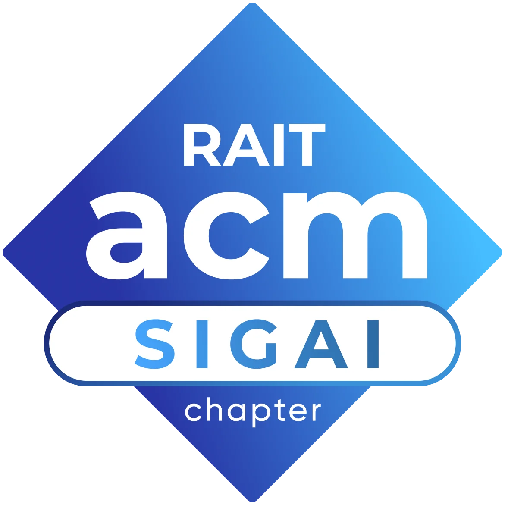

# 🧭 Community Guidelines — RAIT ACM SIGAI

## 1. Our Goal

We are a community of students, contributors, and leaders who strive to make participation in this space a welcoming and positive experience for everyone. We encourage all participants to act and interact in ways that contribute to an open, inclusive, and healthy community.

This document outlines our *expectations* for behavior, not a formal set of rules.

---

## 2. Our Standards

Examples of behavior that contributes to a positive environment include:

-   🤝 Demonstrating empathy and kindness toward other people
-   🗣️ Being respectful of differing opinions, viewpoints, and experiences
-   🎓 Giving and gracefully accepting constructive feedback
-   ❤️ Focusing on what is best for the community
-   🧑‍🤝‍🧑 Showing respect toward other community members

Examples of behavior we discourage include:

-   👎 The use of sexualized language or imagery, and sexual attention or advances
-   😠 Trolling, insulting or derogatory comments, and personal or political attacks
-   🚫 Public or private harassment
-   🔒 Publishing others' private information without their explicit permission
-   🙅 Other conduct which could reasonably be considered inappropriate in a professional setting

---

## 3. Moderation

In the interest of keeping this community space welcoming, repository maintainers **may** remove, edit, or reject comments, commits, code, issues, and other contributions that do not align with these Community Guidelines.

This is a peer-to-peer community space, and moderation is handled informally by student volunteers.

---

## 4. Scope

These guidelines apply to all interactions within this repository, including issues, comments, and project files.

---

## 5. Reporting

If you observe behavior that you believe violates these guidelines, you can use GitHub's built-in **"Report content"** feature.

Alternatively, you may choose to bring it to the attention of a repository maintainer directly, who **may** look into it as they are able. There is no guaranteed or formal investigation process.

---

## 6. Disclaimer

These guidelines are not legally binding and do not create any formal "responsibility" or "obligation" for any person, committee, or organization. This repository is not an official platform of RAIT, ACM, or any other institution, and they hold no liability for the content or interactions within.

---

## 7. Attribution

These guidelines are adapted from the **Contributor Covenant**, version 2.1, available at [https://www.contributor-covenant.org/version/2/1/code_of_conduct.html](https://www.contributor-covenant.org/version/2/1/code_of_conduct.html).
